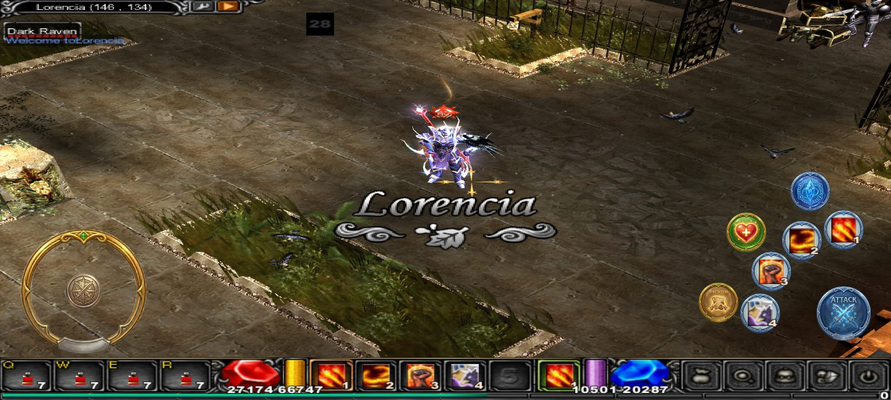
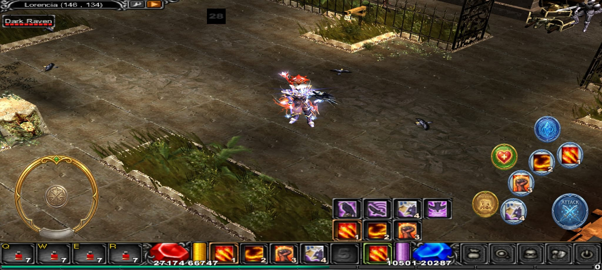
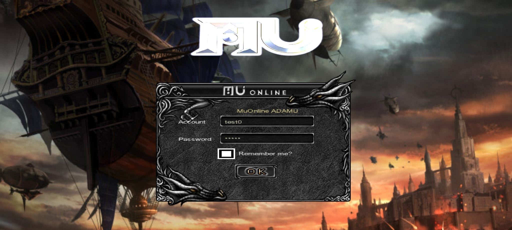
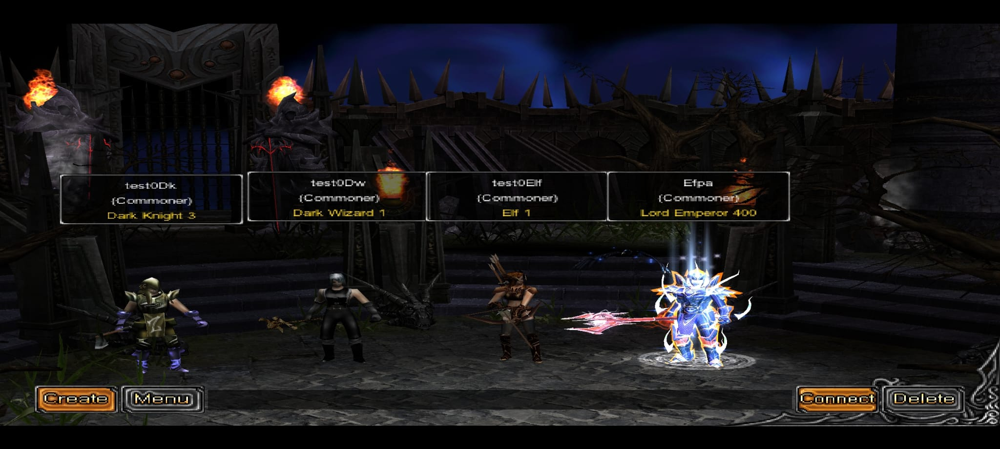
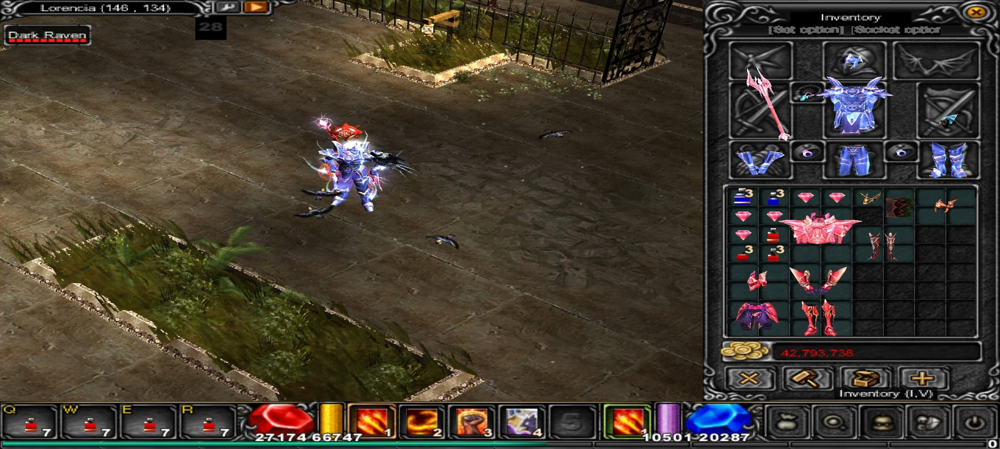
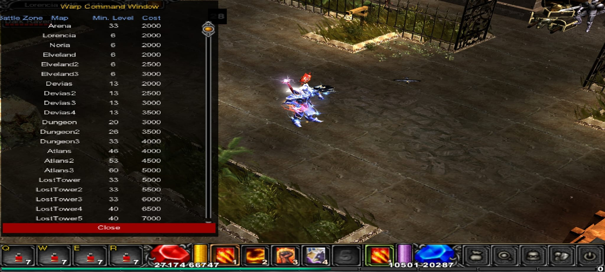
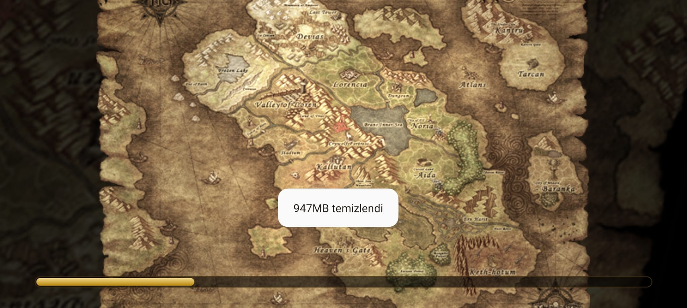
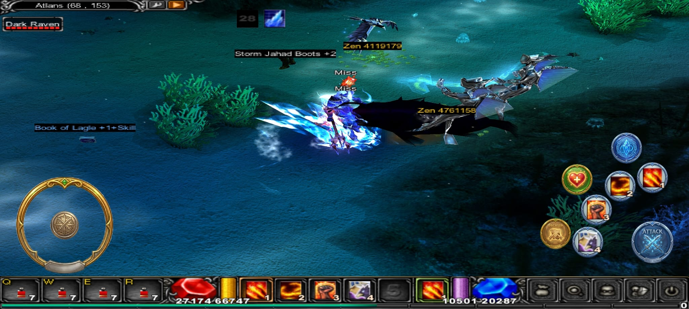

# MU Online — Android Port (Season 6 Ep.3)

##TUR

MU Online S6 istemcisinin çalışan Android portu — cihazda native açılıyor, canlı bir
OpenMU sunucusuna bağlanıyor ve dokunmatik kontrollerle (sanal joystick, saldırı/skill/
pot butonları) baştan sona oynanabiliyor. **Geliştirme devam ediyor.**

## Görseller / Video
<!-- kendi ekran görüntülerini / videonu buraya ekle -->
|  |  |
|--|--|
|  |  |
|  |  |

🎥 Oynanış videosu: mobile_muonline_s6e3.mp4

## Performans

Gerçek orta-segment cihaz (Adreno 618):

| Sahne | FPS |
|------|----:|
| Login | ~130–150 |
| Karakter seçim | ~50 |
| Oyun içi (Lorencia) | ~45–50 |

Oyun içi kare maliyeti (ms/kare, temsili):

| Geçiş (pass) | ms |
|------|----:|
| Terrain | ~6 |
| Objects | ~3–11 * |
| Characters | ~1–5 * |
| UI | ~3 |

* sahne yoğunluğuna göre değişir (ekrandaki canavar / diğer oyuncu sayısı)

> Oyun içi FPS, ilk derlemelerdeki ~5–8'den ~30–50'ye çıktı — optimizasyon sürüyor.

## Sunucu & Teşekkür

Sunucu tarafında [**OpenMU**](https://github.com/MUnique/OpenMU) kullanıldı — açık kaynak
OpenMU ekibine teşekkürler. 🙏

https://github.com/MUnique/OpenMU

##ENG

# MU Online — Android Port (Season 6 Ep.3)

A working Android port of the MU Online S6 client — runs natively on device, connects to a
live OpenMU server, and is fully playable with on-screen touch controls (virtual joystick,
attack / skill / potion buttons). **Work in progress.**

## Screenshots / Video
<!-- add your own screenshots / video -->
|  |  |
|--|--|
|  |  |
|  |  |

🎥 Gameplay video: mobile_muonline_s6e3.mp4

## Performance

Real mid-range device (Adreno 618):

| Scene | FPS |
|------|----:|
| Login | ~130–150 |
| Character select | ~50 |
| In-game (Lorencia) | ~45–50 |

In-game frame cost (ms/frame, representative):

| Pass | ms |
|------|----:|
| Terrain | ~6 |
| Objects | ~3–11 * |
| Characters | ~1–5 * |
| UI | ~3 |

* depends on how busy the scene is (monsters / other players on screen)

> In-game frame rate keeps improving across builds — optimization is ongoing.

## Server & Credits

The server side runs on [**OpenMU**](https://github.com/MUnique/OpenMU) — an open-source
Thanks to the OpenMU team. 🙏
